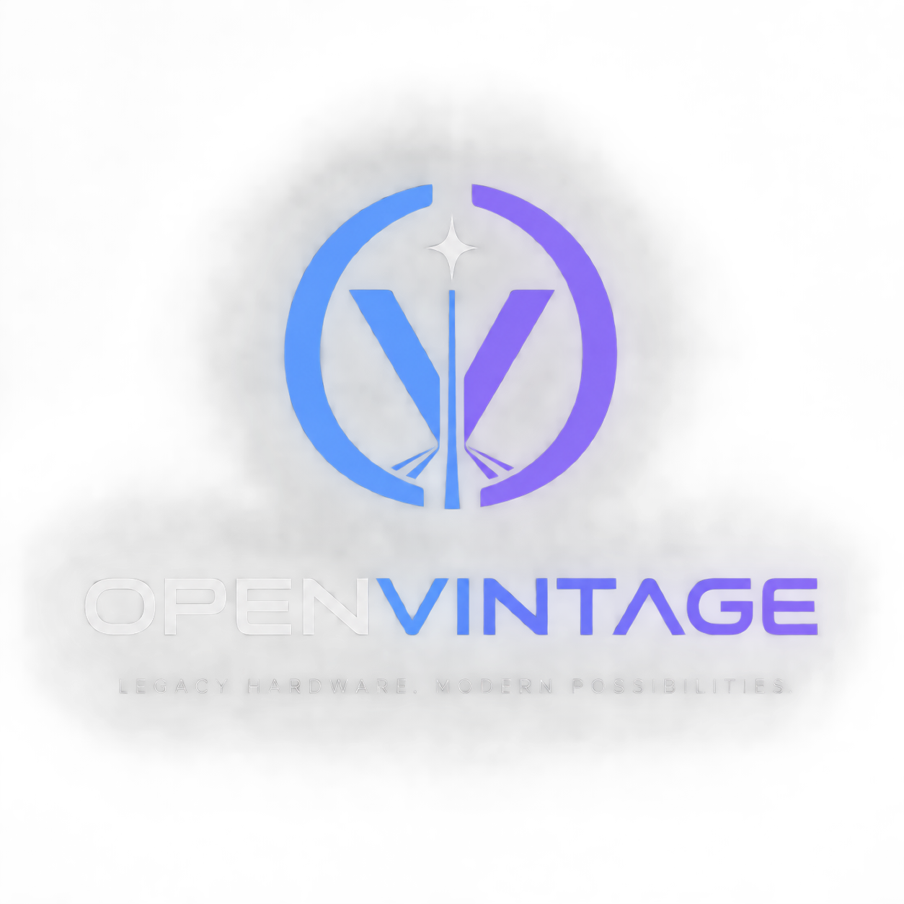

Hardware-aware macOS compatibility, boot integration, graphics translation, and adaptive optimization platform for legacy and modern Apple hardware.

OpenVintage is an experimental systems platform designed to build a deeper compatibility layer between Apple hardware and macOS than a conventional bootloader or static patch set.

The project combines a native x86-64 EFI environment, hardware intelligence, compatibility resolution, driver/kext orchestration, CPU/GPU intermediate representations, macOS integration, userspace compatibility, adaptive performance optimization, and recovery infrastructure.

«Project status: Active experimental development
Architecture status: Core integration infrastructure implemented; advanced macOS compatibility and adaptive systems are under development.
Physical deployment: Experimental. QEMU/OVMF and controlled test environments are the primary validation targets.»

---

Vision

OpenVintage aims to transform legacy-hardware compatibility from a collection of static patches into an adaptive compatibility platform.

Instead of applying the same configuration to every machine, OpenVintage is designed around:

Detect
  ↓
Understand
  ↓
Resolve
  ↓
Plan
  ↓
Validate
  ↓
Integrate
  ↓
Boot
  ↓
Measure
  ↓
Optimize
  ↓
Learn

The system should understand the actual hardware configuration and select the appropriate compatibility mechanisms for the requested macOS version.

The long-term architecture contains two intentionally isolated macOS compatibility pathways:

                    OpenVintage
                         │
                 Hardware Intelligence
                         │
                 Compatibility Router
                    /            \
                   /              \
              LEGACY            OPTIMUS
             macOS 11–15        macOS 27+
                  │                │
            OCLP-compatible     OpenVintage
               pathway          experimental
                  │                │
                  └───────┬────────┘
                          ↓
                  Integration Engine
                          ↓
             Drivers / Kexts / Patches
                          ↓
                 Userspace Compatibility
                          ↓
              CPU / GPU Compatibility
                          ↓
              Adaptive Optimization
                          ↓
                    macOS

Legacy and Optimus do not share ownership of macOS-specific compatibility logic.

They share only common infrastructure such as hardware detection, capability modeling, validation, and the underlying OpenVintage execution framework.

---

Core Architecture

OpenVintage is divided into several layers.

┌───────────────────────────────────────────────┐
│                 macOS Experience              │
├───────────────────────────────────────────────┤
│             Userspace Compatibility           │
├───────────────────────────────────────────────┤
│       Graphics / CPU / Framework Adapters     │
├───────────────────────────────────────────────┤
│       Kext / Driver / Patch Integration       │
├───────────────────────────────────────────────┤
│       Legacy / Optimus Compatibility          │
├───────────────────────────────────────────────┤
│             Compatibility Resolver            │
├───────────────────────────────────────────────┤
│        Hardware & Capability Intelligence      │
├───────────────────────────────────────────────┤
│              OpenVintage Core                 │
├───────────────────────────────────────────────┤
│                EFI / HAL Layer                │
└───────────────────────────────────────────────┘

Each layer has a defined responsibility.

---

Hardware Intelligence

The Hardware Intelligence layer provides a single authoritative description of the machine.

It can model:

- Mac model and identifier
- CPU architecture and capabilities
- CPU features
- GPU vendor/device
- GPU generation
- VRAM
- Metal capabilities
- display topology
- PCI devices
- audio hardware
- USB controllers
- SATA/NVMe storage
- Ethernet
- Wi-Fi
- Bluetooth
- camera
- keyboard and trackpad
- sensors
- battery information
- EFI/BootROM characteristics
- hardware quirks

The resulting structure is conceptually:

OvHardwareSnapshot
        ↓
OvCapabilityGraph
        ↓
OvCompatibilityInput

Every compatibility subsystem should consume this shared model instead of implementing independent hardware detection.

---

Compatibility Router

The Compatibility Router determines which compatibility pathway should handle the requested macOS version.

                    Target macOS
                         │
                  Compatibility Router
                    /             \
                   /               \
              LEGACY             OPTIMUS
             11–15                27+

The router must never silently guess.

Possible results include:

LEGACY
OPTIMUS
UNKNOWN
UNSUPPORTED
EXPERIMENTAL

A compatibility decision should contain:

Target OS
Detected hardware
Selected pathway
Required capabilities
Compatibility state
Reasoning
Validation state

macOS versions outside the defined pathways are explicitly represented as unknown or unsupported rather than automatically receiving an inappropriate configuration.

---

Legacy

macOS 11–15

Legacy is the compatibility pathway for macOS versions 11 through 15.

Legacy/
├── BigSur/
├── Monterey/
├── Ventura/
├── Sonoma/
└── Sequoia/

Legacy is designed to support an OCLP-compatible integration model.

OpenVintage can provide the surrounding hardware detection, compatibility resolution, boot orchestration, validation, and profile management while keeping macOS-specific implementation boundaries clear.

OpenVintage does not claim to replace OpenCore Legacy Patcher simply because a Legacy interface exists.

Actual support is established only when the required implementation has been developed and tested.

---

Optimus

macOS 27+

Optimus is OpenVintage's experimental future-macOS compatibility pathway.

Optimus/
├── Common/
├── Tahoe/
└── Future/
    ├── macOS28/
    ├── macOS29/
    └── ...

Optimus is intended for:

- macOS Tahoe
- future macOS releases
- hardware compatibility research
- deeper graphics compatibility
- driver/kext integration
- userspace compatibility
- adaptive optimization

Optimus is an experimental OpenVintage architecture.

The existence of the Optimus subsystem does not itself establish that a particular Mac can run a particular future macOS release.

Each capability must be independently implemented and validated.

---

Kext & Driver Integration

OpenVintage treats driver and kext integration as a first-class subsystem.

OvKextManager
│
├── Graphics
├── Display
├── Audio
├── USB
├── Storage
├── Ethernet
├── Wi-Fi
├── Bluetooth
├── Input
├── Camera
└── Sensors

The EFI environment should not contain an enormous hard-coded collection of every possible driver.

Instead:

Hardware Detection
       ↓
Capability Matching
       ↓
Kext Manifest
       ↓
Required Components
       ↓
Validation
       ↓
Boot Integration

This permits hardware-specific compatibility packages without duplicating the same logic across the project.

Kext metadata should describe:

Identifier
Version
Target OS range
Supported hardware
Dependencies
Required patches
Security requirements
Validation status
Rollback information

---

Boot Integration Engine

The Boot Integration Engine produces a declarative boot plan.

OvBootPlan

A plan can contain:

Target operating system
Compatibility pathway
Hardware profile
Kext set
Patch set
Boot arguments
Graphics configuration
CPU configuration
Security requirements
Recovery information
Validation results

The fundamental rule is:

PLAN → VALIDATE → APPLY

rather than:

APPLY → HOPE

This is essential for experimental compatibility work.

---

Graphics Compatibility

Graphics compatibility is one of OpenVintage's major subsystems.

The existing OVIR-GPU architecture provides an abstraction layer for hardware capabilities and graphics operations.

Conceptually:

macOS Graphics API
        ↓
Graphics Compatibility Layer
        ↓
OVIR-GPU
        ↓
GPU Capability Resolver
        ↓
Available Hardware

Potential responsibilities include:

- GPU capability detection
- feature fallback
- graphics API abstraction
- shader handling
- shader caching
- pipeline caching
- resource management
- VRAM management
- display configuration
- frame timing
- graphics telemetry
- compatibility-aware feature selection

OpenVintage should distinguish between:

API compatibility
Driver compatibility
GPU capability
Display routing
OS framework compatibility

These are related but not interchangeable.

---

CPU Compatibility

OVIR-CPU provides an architecture-neutral intermediate representation for CPU compatibility and translation.

Conceptually:

Source architecture
        ↓
OVIR-CPU
        ↓
Optimizer
        ↓
Target backend
        ↓
Execution

The architecture supports:

- architecture-neutral instructions
- decoding
- optimization
- translation caching
- JIT-oriented execution
- x86-64 backend
- ARM64 backend
- scheduler integration

CPU translation and GPU translation remain separate subsystems.

---

Userspace Compatibility

OpenVintage is designed to extend compatibility beyond the boot and kernel layers.

Application
     ↓
macOS Framework/API
     ↓
Compatibility Resolver
     ↓
Native implementation
       OR
Translated implementation
       OR
Validated fallback

Potential areas include:

- framework compatibility
- graphics frameworks
- API compatibility
- legacy application behavior
- system service interfaces
- feature fallback
- userspace performance adaptation

Userspace compatibility must remain version-aware and must not assume that an API behaves identically across macOS releases.

---

Adaptive Performance Engine

OpenVintage can use measured system behavior to produce hardware-specific optimization profiles.

Telemetry may include:

CPU utilization
GPU utilization
GPU memory
Memory pressure
Frame timing
Shader compilation
Translation overhead
Cache hit rate
I/O behavior
Thermal state
Application compatibility results

The objective is not simply maximum performance.

The optimizer should be capable of selecting among competing goals:

Performance
Visual quality
Responsiveness
Power efficiency
Stability
Compatibility

Optimization decisions must be measurable and reversible.

---

Self-Learning Optimization

The long-term OpenVintage architecture includes a self-improving optimization engine.

The engine should learn configuration strategies and compatibility profiles, rather than arbitrarily rewriting its own executable code.

Observe
   ↓
Analyze
   ↓
Generate Candidate
   ↓
Validate
   ↓
Benchmark
   ↓
Accept / Reject
   ↓
Store Profile
   ↓
Future Optimization

A profile can associate:

Hardware
+
macOS version
+
Application/workload
+
Compatibility configuration
+
Measured results

with an optimization strategy.

This allows OpenVintage to improve its decisions as more validated data becomes available.

---

Optimization Safety Model

No learned optimization should automatically become permanent merely because it produced one good result.

Candidate changes should pass through:

Candidate
   ↓
Static validation
   ↓
Compatibility validation
   ↓
Controlled test
   ↓
Performance measurement
   ↓
Stability check
   ↓
Profile approval

A failed optimization must be discardable without affecting the baseline configuration.

---

Transactional System Modification

System modifications should use transactional deployment.

Backup
  ↓
Prepare
  ↓
Validate
  ↓
Apply
  ↓
Boot
  ↓
Verify
  ↓
Commit

If verification fails:

Failed configuration
        ↓
Recovery
        ↓
Known-good configuration

OpenVintage should preserve a known-good configuration whenever possible.

---

Recovery

Recovery is a core subsystem rather than an afterthought.

It should provide:

- configuration rollback
- failed-boot detection
- known-good configuration
- compatibility profile rollback
- failed patch isolation
- diagnostic logging
- recovery boot path
- validation reports

The system must distinguish between:

Boot failure
Driver failure
Graphics failure
Userspace failure
Performance regression
Compatibility failure

so that recovery does not unnecessarily discard unrelated working components.

---

Native macOS Integration

The native macOS component provides userspace tools and system information.

The application can expose:

Hardware
Compatibility
Boot Plans
Kext Status
Graphics
Performance
Diagnostics
Optimization Profiles
Recovery

The native macOS layer should remain separate from the EFI implementation.

OpenVintage.app
       │
       ↓
OpenVintage Core Interfaces
       │
       ↓
Hardware / Compatibility / Diagnostics

The application can prepare and review changes without requiring the EFI environment to implement every userspace function.

---

QEMU / Preboot Simulation

Experimental changes should be tested in simulation before physical deployment whenever practical.

OpenVintage
     ↓
Preboot Simulator
     ↓
OVMF / QEMU
     ↓
Synthetic Hardware
     ↓
Validation

The simulator can emulate:

- hardware profiles
- GPU capabilities
- CPU capabilities
- macOS target profiles
- kext manifests
- compatibility decisions
- boot plans
- failure conditions
- recovery behavior

This allows new compatibility logic to be tested without immediately modifying physical hardware.

---

Security Model

OpenVintage separates:

Detection
Simulation
Planning
Review
Approval
Backup
Application
Verification
Recovery

Firmware images and EFI artifacts used during development are controlled test artifacts.

They should not be treated as universal firmware images for arbitrary physical Macs.

Hardware-specific validation is required before physical deployment.

---

Repository Structure

The intended architecture is approximately:

Openvintagew/
│
├── OpenVintagePkg/
│   ├── Core/
│   ├── HAL/
│   ├── Hardware/
│   ├── Resolver/
│   ├── Scheduler/
│   ├── ResourceManager/
│   ├── Compatibility/
│   ├── Diagnostics/
│   ├── Benchmark/
│   ├── OvirCpu/
│   └── OvirGpu/
│
├── Compatibility/
│   ├── Legacy/
│   │   ├── BigSur/
│   │   ├── Monterey/
│   │   ├── Ventura/
│   │   ├── Sonoma/
│   │   └── Sequoia/
│   │
│   └── Optimus/
│       ├── Common/
│       ├── Tahoe/
│       └── Future/
│
├── Integration/
│   ├── KextManager/
│   ├── PatchManager/
│   ├── BootManager/
│   └── BootPlan/
│
├── Userspace/
│   ├── Compatibility/
│   ├── Optimization/
│   └── Telemetry/
│
├── OpenVintage.app/
│
├── OpenVintagePrebootSimulator/
│
├── Tests/
│
├── ARCHITECTURE.md
├── PROJECT_STATUS.md
├── SYSTEM_STATUS.md
├── SECURITY.md
├── CHANGELOG.md
└── Makefile

The exact directory layout may evolve as implementation progresses.

---

Development Phases

Phase 1 — EFI Foundation

Establish the native x86-64 EFI environment and boot application.

Goals:

- EFI application
- boot environment
- logging
- device enumeration
- basic diagnostics
- controlled build system

---

Phase 2 — Hardware Abstraction Layer

Create a hardware abstraction layer capable of describing legacy Apple hardware.

Goals:

- CPU detection
- memory detection
- PCI enumeration
- GPU identification
- platform identification
- hardware capability interfaces

---

Phase 3 — OVIR-GPU

Create the graphics intermediate representation and GPU capability system.

Goals:

- GPU capability model
- command representation
- validation
- graphics API abstraction
- shader handling
- resource management
- telemetry foundations

---

Phase 4 — Resolver & Architecture

Unify hardware capabilities and compatibility decisions.

Goals:

- resolver architecture
- compatibility matching
- CPU/GPU execution planning
- capability fallback
- resource constraints
- hardware-aware planning

---

Phase 5 — System Integration

Integrate:

Boot
 ↓
Firmware
 ↓
Core
 ↓
HAL
 ↓
Resolver
 ↓
OVIR-CPU
 ↓
OVIR-GPU
 ↓
Scheduler

Status: Core integration infrastructure established and undergoing continued validation.

---

Phase 6 — Hardware Intelligence

Create the authoritative:

OvHardwareSnapshot
OvCapabilityGraph

Implement unified detection and capability normalization.

Exit criteria:

- deterministic hardware inventory
- repeatable capability results
- simulator support
- real-hardware comparison tests

---

Phase 7 — Compatibility Router

Implement Legacy/Optimus routing.

11–15 → Legacy
27+   → Optimus

Add explicit handling for unknown and unsupported versions.

Exit criteria:

- deterministic routing
- version validation
- hardware-aware requirements
- complete automated test coverage

---

Phase 8 — Kext & Driver Integration

Create the kext manifest and hardware matching system.

Subsystems:

Graphics
Display
Audio
USB
Storage
Network
Bluetooth
Input
Camera
Sensors

Exit criteria:

- dependency resolution
- hardware matching
- version matching
- validation
- rollback metadata

---

Phase 9 — Boot Integration

Create the declarative "OvBootPlan".

Goals:

- boot configuration
- kext selection
- patch selection
- boot arguments
- validation
- recovery metadata

---

Phase 10 — Legacy Compatibility

Implement the macOS 11–15 pathway.

Goals:

- version profiles
- hardware compatibility profiles
- OCLP-compatible integration interfaces
- boot-plan generation
- validation
- recovery

---

Phase 11 — Optimus Foundation

Establish the macOS 27+ experimental architecture.

Goals:

- Tahoe profile infrastructure
- future-version profile system
- compatibility interfaces
- experimental capability tracking
- strict separation from Legacy

---

Phase 12 — Graphics Compatibility

Connect the macOS graphics compatibility system to OVIR-GPU.

Goals:

- GPU capability resolution
- graphics feature fallback
- shader compatibility
- resource translation
- display handling
- frame-time measurement

---

Phase 13 — Userspace Compatibility

Expand compatibility into macOS userspace.

Goals:

- framework compatibility
- API resolution
- application compatibility
- fallback mechanisms
- userspace diagnostics

---

Phase 14 — Adaptive Performance

Integrate telemetry with the optimization engine.

Goals:

- performance profiles
- CPU/GPU scheduling
- memory optimization
- caching
- frame pacing
- workload-specific configuration

---

Phase 15 — Visual & Graphics Optimization

Optimize the complete visual pipeline.

Goals:

- display configuration
- compositor behavior
- graphics feature selection
- shader caching
- frame pacing
- visual-quality/performance balancing

---

Phase 16 — Self-Learning Optimizer

Introduce validated adaptive learning.

Goals:

Observe
Analyze
Experiment
Measure
Validate
Learn

The system learns optimization profiles while maintaining a stable baseline.

---

Phase 17 — Recovery & Transaction System

Make compatibility modifications reversible.

Goals:

- backups
- transactional application
- boot verification
- automatic rollback
- known-good profiles
- failure isolation

---

Phase 18 — Universal Validation

Validate the complete platform.

Testing should cover:

QEMU
OVMF
Synthetic hardware
Legacy Intel Macs
Different GPU generations
macOS 11–15
macOS 27+
Multiple hardware configurations
Failure scenarios
Recovery scenarios
Performance regressions

Every capability receives an explicit state:

IMPLEMENTED
TESTED
PARTIAL
EXPERIMENTAL
UNSUPPORTED

---

Design Principles

Hardware First

Compatibility decisions begin with actual hardware capabilities.

Separation of Concerns

Legacy and Optimus remain independent compatibility pathways.

Plan Before Apply

The system should generate and validate a plan before making changes.

Measured Optimization

Performance improvements must be measurable rather than assumed.

Reversible Changes

Experimental changes should have a recovery path.

No False Compatibility

An interface, abstraction, or folder does not count as functional support.

Simulation Before Deployment

QEMU/OVMF and controlled test 
